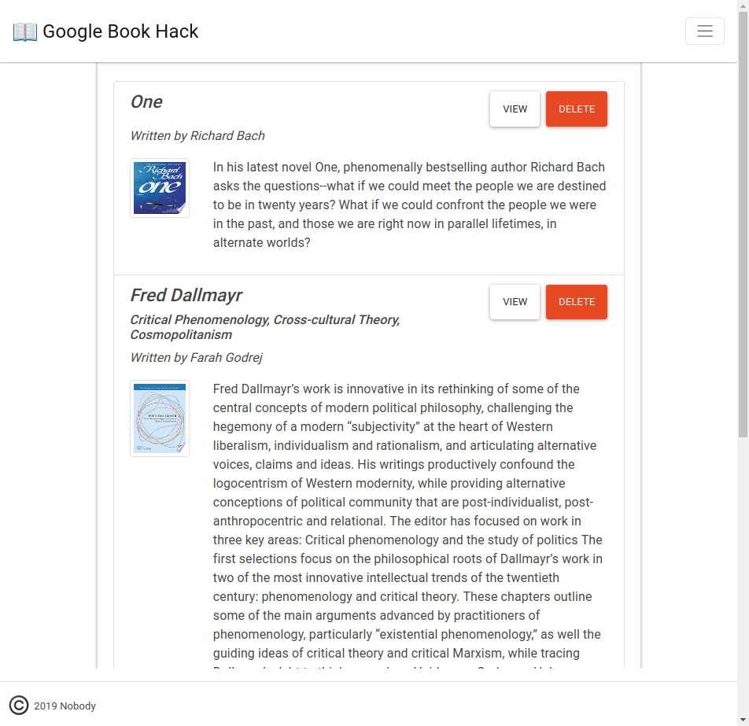

# Google Book Hack

This is a simple app that grabs data from google and stores data in a mongo database.

[The Site](https://google-book-hack.herokuapp.com)

## API

- Query Google : `GET /api/google/`
- Get saved books : `GET /api/books/`
- Create a book : `POST /api/books/`
- Get a saved book : `GET /api/books/:id`
- Update a saved book : `PUT /api/books/:id`
- Remove a saved book : `DELETE /api/books/:id`

## Specs

- React front-end
- Express back-end

## A Screenshot

